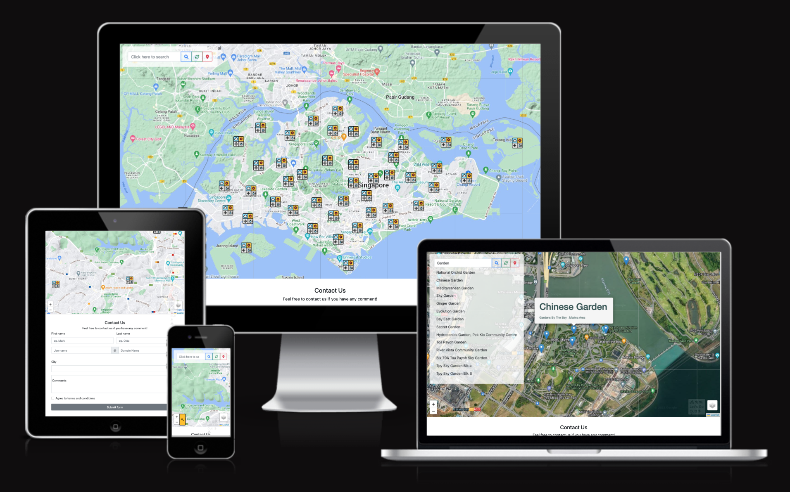

# TGCProject1 - Let's Go Out!!

# Context

A interactive map and mobile-responsive web app called 'Let's Go Out'. Users can select different layers to see nparks and tracks, as well as searching for locations in the map with the selected layers.

# Demo

A live website of the application can be found [here](https://leafletjs-sport-map.netlify.app).

# Tech

- HTML5
- CSS3
- JavaScript
- APIs
